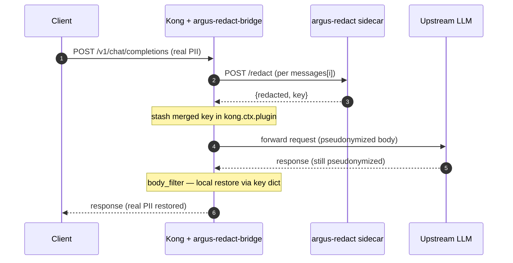

# kong-plugin-argus-redact

> Kong Gateway plugin: redact PII before upstream LLM calls, restore it on the response — transparently.

[](https://github.com/wan9yu/kong-plugin-argus-redact/actions/workflows/test.yml)
[](https://luarocks.org/modules/wan9yu/argus-redact-bridge)
[](LICENSE)
[](https://docs.konghq.com/gateway/)

## 60-second demo

```bash
git clone https://github.com/wan9yu/kong-plugin-argus-redact && cd kong-plugin-argus-redact
docker compose -f docker/docker-compose.yml up -d --build
curl -s localhost:18000/v1/chat/completions -H 'Content-Type: application/json' \
  -d '{"model":"gpt-4","messages":[{"role":"user","content":"我叫王五，手机13812345678"}]}' | jq
```

## What you actually see

```jsonc
// 1. Client sends — real PII
{"messages":[{"role":"user","content":"我叫王五，手机13812345678"}]}

// 2. Upstream LLM receives — pseudonymized, real PII never crosses the wire
{"messages":[{"role":"user","content":"我叫傻大姐,手机19999173649"}]}

// 3. Client receives back — original PII restored
{"choices":[{"message":{"content":"echo: 我叫王五,手机13812345678"}}]}
```

## Architecture



## What it doesn't do (v0.1)

The honest gap, before you adopt:

- **No streaming.** `stream: true` is rejected with HTTP 400. Token-level SSE doesn't honor logical-unit boundaries; correct streaming support is on the v1 roadmap.
- **OpenAI Chat Completions only.** The Anthropic Messages API, Google Vertex, and other vendor shapes are not understood. Only `{messages: [{role, content: <string>}]}` in and `{choices: [{message: {content}}]}` out.
- **No cross-language alias restore.** If the LLM rewrites `张三` as `Zhang San`, the response carries `Zhang San` through unchanged — local restore catches verbatim placeholders only. (OpenResty forbids HTTP calls from the `body_filter` phase, so we can't ask argus-redact's `/restore` to do the smarter alias-aware match.)
- **No batched redact.** N messages = N sequential `POST /redact` calls. v1 wishlist depends on a batch endpoint on the argus-redact side.
- **Multimodal content arrays are skipped.** A `content: [{type:"text", text:...}]` array is not redacted (only string `content` fields are). The request still flows through unmodified.
- **Single-form output.** argus-redact's three-form output (`audit_text` / `downstream_text` / `display_text`) is not exposed via HTTP — only the realistic single form is used.

## What it does

`mode=fast`, `profile=pseudonym-llm` (defaults):

1. **access phase** — extract every `messages[].content`, send each to argus-redact's `/redact`, replace with the realistic pseudonym, stash the merged `{placeholder → original}` key map in `kong.ctx.plugin`, forward the modified body upstream.
2. **body_filter phase** — buffer the upstream response until EOF, parse `choices[].message.content`, restore the original PII via local string substitution against the stashed key, write back.

**Failure mode:** `on_error: closed` (default) — if argus-redact is unreachable during access, the request is rejected with HTTP 503; unredacted PII never reaches the LLM. Set `on_error: open` to fail open with a warning log.

## Install

```bash
luarocks install argus-redact-bridge
export KONG_PLUGINS=bundled,argus-redact-bridge
```

DB-less example:

```yaml
# kong.yml
plugins:
  - name: argus-redact-bridge
    config:
      argus_url: http://argus-redact:8000
      argus_api_key: "{vault://env/ARGUS_API_KEY}"
      lang: zh
      mode: fast
      profile: pseudonym-llm
      on_error: closed
```

For production, run `argus-redact serve` with `ARGUS_API_KEY` set (drop the `--insecure` flag the demo uses) and reference the same key via Kong's vault syntax. The shipped `docker/docker-compose.yml` runs `--insecure` for self-contained reproducibility only.

## Configuration

| Field | Type | Default | Description |
|---|---|---|---|
| `argus_url` | string (required) | `http://argus-redact:8000` | Base URL of the argus-redact HTTP server. |
| `argus_api_key` | string (referenceable) | — | Bearer token. Must match `ARGUS_API_KEY` on the argus-redact server. Use Kong vault references in production. |
| `lang` | string | `zh` | argus-redact language pack (`zh`, `en`, `ja`, `ko`, `de`, `uk`, `in`, `br`). |
| `mode` | enum | `fast` | argus-redact detection mode (`fast`, `ner`, `auto`). Only `fast` is suited to the request path; `ner` and `auto` are exposed for completeness but their latency profile makes them better suited to async / sidecar deployments than to inline gateway use. |
| `profile` | string | `pseudonym-llm` | argus-redact compliance profile. `pseudonym-llm` emits realistic-looking faked values that preserve LLM-reasoning quality. |
| `timeout_ms` | integer | `2000` | Per-call timeout for `/redact`. Bounded to `[100, 60000]`. |
| `on_error` | enum | `closed` | Behavior when argus-redact is unreachable during the access phase. `closed`: return 503. `open`: log a warning and pass the original request through unmodified. |

## Compatibility

- **Kong Gateway 3.x**, DB-less or DB-mode. CI builds and the demo stack pin `kong:3.7.1-ubuntu`. The plugin uses only stable PDK 1.x surfaces (`kong.request.get_raw_body`, `kong.service.request.set_raw_body`, `kong.ctx.plugin`, `kong.response.exit/clear_header`, `kong.log.*`, schema `typedefs.protocols_http`) so 3.x family compatibility is expected, but only 3.7.1 is in CI.
- **OpenResty 1.21+** (Kong 3.x runtime).
- **argus-redact 0.6.4+** as the sidecar (`pip install 'argus-redact[serve]'`).

## Performance

End-to-end latency on the demo stack, `mode=fast`, single 25-character Chinese PII payload, N=100 with 5-request warmup. Plugin steady-state overhead alone is ~0.5–0.8 ms at p50; the rows below are full-path numbers including the request-body parse, `POST /redact` to the sidecar, body inject, upstream mock-LLM call, response body buffer, and local restore.

| Host | p50 | p95 | p99 | throughput |
|---|---|---|---|---|
| Linux aarch64 (Parallels VM, native Docker) | 1.8 ms | 2.6 ms | 42.4 ms | 196 req/s |
| macOS (Apple M1 Max, Docker Desktop) | 6.6 ms | 10.8 ms | 17.0 ms | 42 req/s |

Reproduce with `bash scripts/bench.sh` after `docker compose -f docker/docker-compose.yml up -d --build`. Numbers vary with payload size, message count, network distance to the sidecar, and host hardware. Docker Desktop on macOS adds 3–5× hypervisor + bind-mount overhead vs. native Linux; production deployments on Linux nodes should expect the upper row, not the lower one.

**Cold-start tax.** Without warmup, the first few `/redact` calls after the argus-redact container starts can take 1–4 seconds (Python imports and regex compilation). Production deployments should warm the sidecar — a single dummy `/redact` call, or an initialization healthcheck that exercises the path — before serving traffic. v0.1 ships without an automated warmup hook. See [`benchmarks/vm-test-2026-05-07.md`](benchmarks/vm-test-2026-05-07.md) for the measured cold-start profile.

## Approach

Three patterns dominate gateway-layer PII handling today:

1. **Block-and-reject** — detect sensitive content, refuse the request. Strong privacy guarantee, no usability for legitimate text the regex flags.
2. **Detect-and-strip** — replace PII with placeholders before the upstream call, never restore. Usable, but the client sees pseudonyms and has to map them back manually.
3. **Reversible redact-and-restore** — replace PII with realistic pseudonyms upstream, restore the original on the response. Upstream sees no raw PII; the client sees a normal message. This plugin implements pattern 3.

See [`benchmarks/prvl/`](benchmarks/prvl/README.md) for the privacy × reversibility × language methodology used to measure each pattern.

## Distribution

- **LuaRocks** — `luarocks install argus-redact-bridge` ([package page](https://luarocks.org/modules/wan9yu/argus-redact-bridge)).
- **GitHub Releases** — [tagged release artifacts](https://github.com/wan9yu/kong-plugin-argus-redact/releases) (signed via `tag → CI → luarocks` workflow).
- **Kong Plugin Hub** — Per the maintainer response on [Kong/developer.konghq.com#5157](https://github.com/Kong/developer.konghq.com/pull/5157) (opened 2026-05-07, closed 2026-05-20), Kong's Plugin Hub currently accepts third-party plugins only via Kong's partner certification process, after which a Kong-staff-authored PR lands the docs. The PR is held closed until certification is in place. The PR conversation has the contact path for that process.

## Status

**v0.1 preview.** APIs may change. Production users should pin to a tagged commit.

## License

[Apache 2.0](LICENSE)
